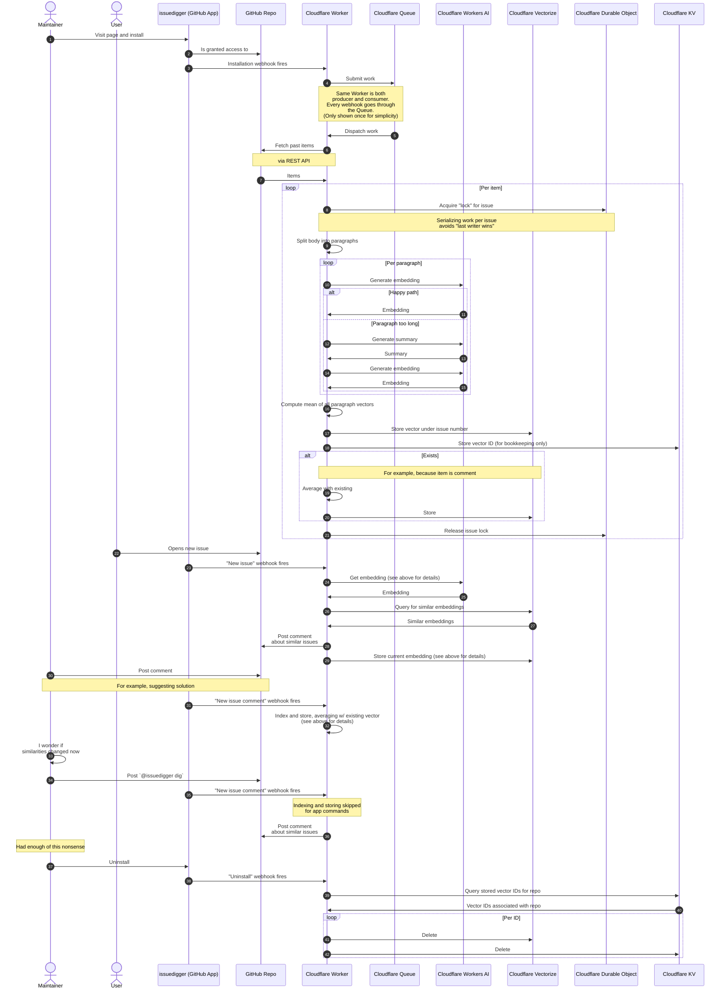

# Architecture

## Working principle

The below sequence diagram shows a detailed (contains all implementation details) sample
software lifecycle, where:

1. a repository maintainer initially installs the application, triggering an initial
   backfill
2. a user later posts a new issue, triggering a comment from issuedigger
3. another user (in this example, the maintainer) comments in that same issue thread.
   The new comment will contribute to that issue's embedding
4. to see if new comments on an issue shifted similarities enough to bring forth new
   results, one can comment `@issuedigger dig`
5. the app can be uninstalled anytime (either by removing it from one's account
   entirely, or revoking access to specific repositores), triggering a wipe of all
   stored data. This is a destructive action, and later reinstallation (possible
   anytime) might not restore all data (due to aforementioned GitHub API request limits)



### Design Notes

- [Durable Objects](https://developers.cloudflare.com/durable-objects/) are used as
  mutexes, in an attempt to serialize work on individual issues.

  When two items of the *same issue thread* are processed concurrently (e.g. during
  backfilling, or if two comments are submitted simultaneously), we'd have
  last-writer-wins issues otherwise, losing data. Serialization by the introduction of a
  per-issue critical section alleviates this.
- [KV Storage](https://developers.cloudflare.com/kv/) is *only* needed for bookkeeping:
  when offboarding an installation, all related vectors need to be removed, but
  Vectorize can only be [queried by exact
  IDs](https://developers.cloudflare.com/vectorize/reference/client-api/#get-vectors-by-id).
  KV with its [prefix
  querying](https://developers.cloudflare.com/kv/api/list-keys/#list-method) helps
  retrieve those exact IDs after the fact.
- Generation of embeddings is pretty [grug-brained](https://grugbrain.dev/). Splitting
  into paragraphs before processing might lose important context. For example,

  ```text
  Her shoes are red.␊
  ␊
  They taste like strawberry.
  ```

  makes no sense if taken (embedded) as one unit. The resulting vector might be
  "semantically malformed". issuedigger instead embeds these separately, and averages
  the results. The resulting mean vector is likely quite different from the single
  embedding, leading to different results.

  Paragraphs are embedded separately chiefly due to **limitations in the [used
  model](https://developers.cloudflare.com/workers-ai/models/bge-large-en-v1.5/)**,
  which maxes out at 512 input tokens (whatever that means in characters 🤷‍♀️). If
  possible, embedding issue (comment) bodies in one go would be wildly preferable.

  If individual paragraphs are *still* overly long, a
  [summarization](https://developers.cloudflare.com/workers-ai/models/#summarization) is
  applied.

  The used models and how issuedigger handles overly long input is likely the bottleneck
  to its usefulness. Available models are lightweight, with very fast inference, at the
  cost of power in other areas, workarounds to which issuedigger implements in
  simplistic, potentially even wrong ways!
