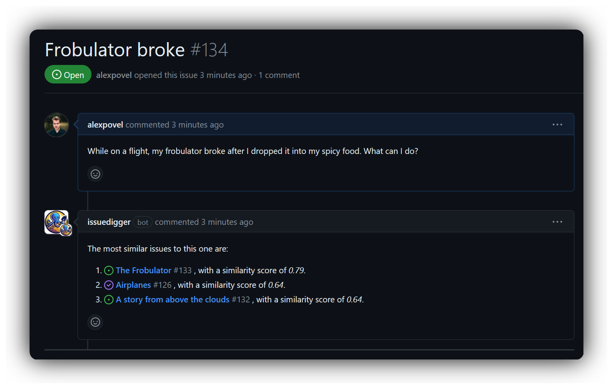
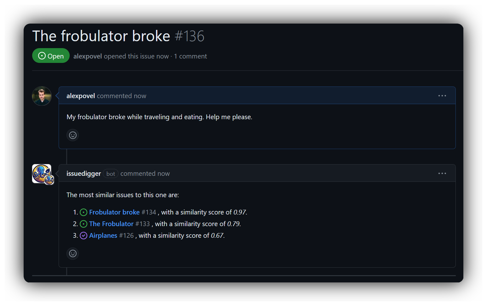

# issuedigger (beta)

*issuedigger* will [notify](https://github.com/alexpovel/issuedigger/issues/134) authors
of new GitHub issues about similar, previously submitted ones, both open and closed:

issuedigger helps maintainers and end users alike avoid having to dig through past
issues (as many projects [request users
do](https://github.com/search?type=code&q=path%3Aissue_template.md+similar) before
submitting new ones). For example, in the above screenshot, the [issue titled
*Airplanes*](https://github.com/alexpovel/issuedigger/issues/126) is *closed*: perhaps
the user finds a solution to their problem there? If successful, the new issue can be
resolved before a second human is even involved.

As a side effect, the *network of related issues* (bugs, feature requests, ...), often
taking up rent-free space on maintainers' minds, can be automated and externalized,
making it accessible to others. For example,
[duplicates](https://github.com/alexpovel/issuedigger/issues/136) can be caught and
linked right away (notice the high similarity score to the above issue):

which
[GitHub](https://docs.github.com/en/issues/tracking-your-work-with-issues/about-issues#integrated-with-github)
will [link
back](https://github.com/alexpovel/issuedigger/issues/134#ref-issue-2206246746) from the
mentioned, original issue automatically:

## Trying it out

Before [installing](#installation) for your own use, feel free to kick issuedigger's
tires by creating issues or issue comments in this repository!

## Beta status

> [!WARNING]
>
> This application is of beta quality. It relies on several products which are
> themselves in beta ([Cloudflare Queues](https://developers.cloudflare.com/queues/),
> [Cloudflare Vectorize](https://developers.cloudflare.com/vectorize/), [Cloudflare
> Workers AI](https://developers.cloudflare.com/workers-ai/)). The project has [no
> tests](tests/README.md) (not without reason). Think of it as an excuse for playing
> with and learning new technology (TypeScript, "AI" (embeddings, vector storage, ...)
> and [Cloudflare's developer products](https://developers.cloudflare.com/)), leading to
> a minimum viable product made available for free, for your convenience.
>
> The embeddings are handled simplistically. It's unknown how useful they (and by
> extension, issuedigger's suggestions) are in real-world scenarios.

### Costs

Running the infrastructure for issuedigger is cheap, but not free. The intention is to
keep it available indefinitely, but there is obviously a risk of shutdown at any time.
The app should not be too hard to spin up on your own account, as
[`wrangler.toml`](wrangler.toml) contains all necessary infrastructure definitions
(clone this repo, run `npx wrangler deploy` and fix errors about missing pieces until it
works...).

## Installation

1. Install the [GitHub App](https://github.com/apps/issuedigger) and grant it access to
   the repositories you'd like the app on.

That's it! The following happens now:

- issuedigger will notice your installation request and start backfilling items (issues
and issue comments). Due to [request limitations in the GitHub
API](https://docs.github.com/en/rest/using-the-rest-api/rate-limits-for-the-rest-api?apiVersion=2022-11-28#primary-rate-limit-for-github-app-installations),
there's a limit to the number of items that will be retroactively made available on
initial installation. This should only affect large repositories.
- after a while (think in the order of a handful of items per second), the
  [database](https://developers.cloudflare.com/vectorize/) is populated
- from now on, issuedigger will:
  - comment once on newly opened issues, and anytime on
  request ([comment `@issuedigger
  dig`](https://github.com/alexpovel/issuedigger/issues/126#issuecomment-2018303228)[^1]).

    (on initial installation, give it some time to populate its database before results
  come up)
  - index every single new item (issue and issue comment), making it available for similarity
    search

    Issue threads are treated as **single units**: the initial issue itself and all
    comments (except ones related to issuedigger itself) will contribute to similarity
    equally. As such, an issue body mentioning concept
    [*A*](https://github.com/alexpovel/issuedigger/issues/131#issue-2205987723), with a
    comment mentioning a (potentially entirely unrelated) concept
    [*B*](https://github.com/alexpovel/issuedigger/issues/131#issuecomment-2018456611),
    can later be
    [suggested](https://github.com/alexpovel/issuedigger/issues/135#issuecomment-2018458230)
    to users opening issues related to both *A* and/or *B*. This helps alleviate [XY
    problems](https://xyproblem.info/).

## Working principle

For a detailed overview, see [ARCHITECTURE.md](ARCHITECTURE.md).

[^1]: Typing `@` will *not* start autocompletion, as it usually does for regular users. Mentioning apps [doesn't work that way](https://github.com/orgs/community/discussions/54188). Don't worry, your comment will still be picked up.
